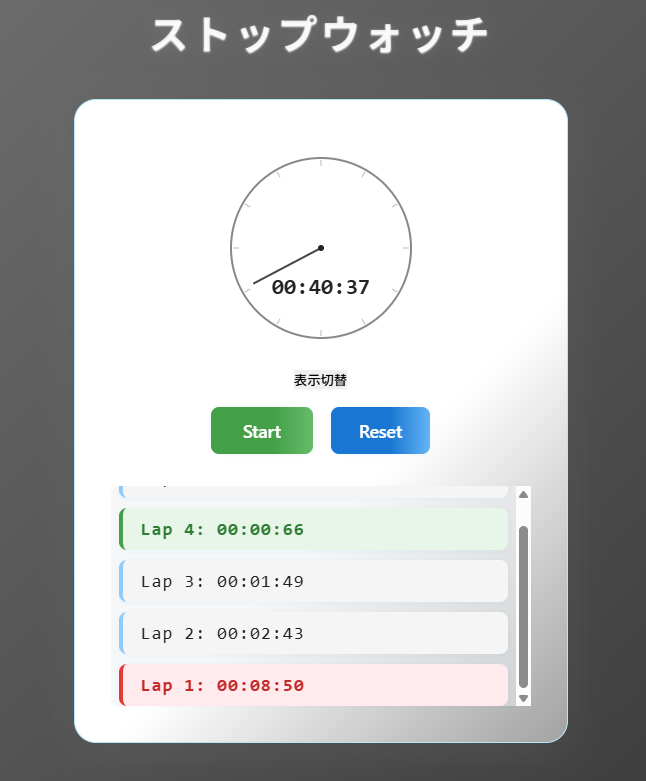

# ストップウォッチアプリ

## 概要

このアプリは、デジタル表示とアナログ表示を切り替えられる現代的なストップウォッチです。  
ラップタイムの記録や、最大・最小ラップのハイライト表示も可能です。

## 主な機能

- デジタル表示とアナログ時計表示の切り替え
- スタート／ストップ／リセット／ラップ機能
- ラップタイムの記録と一覧表示
- 最大・最小ラップタイムの色分け
- レスポンシブデザイン

## 使い方

1. `npm install` で依存パッケージをインストール
2. `npm start` でサーバーを起動
3. ブラウザで `http://localhost:3000` にアクセス

## デザイン

- シンプルで大人っぽい UI
- アナログ時計は canvas で描画
- ボタンやラップ表示も現代的な配色

## ファイル構成

- `public/home.js` ... ストップウォッチのロジック・描画
- `public/home.css` ... スタイルシート
- `views/home.ejs` ... 画面レイアウト

## 
